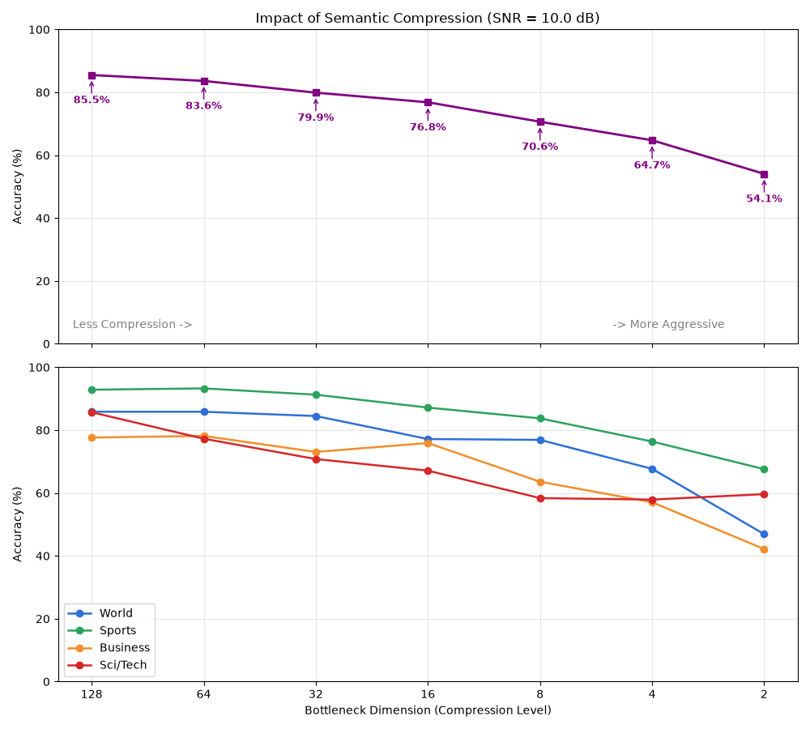
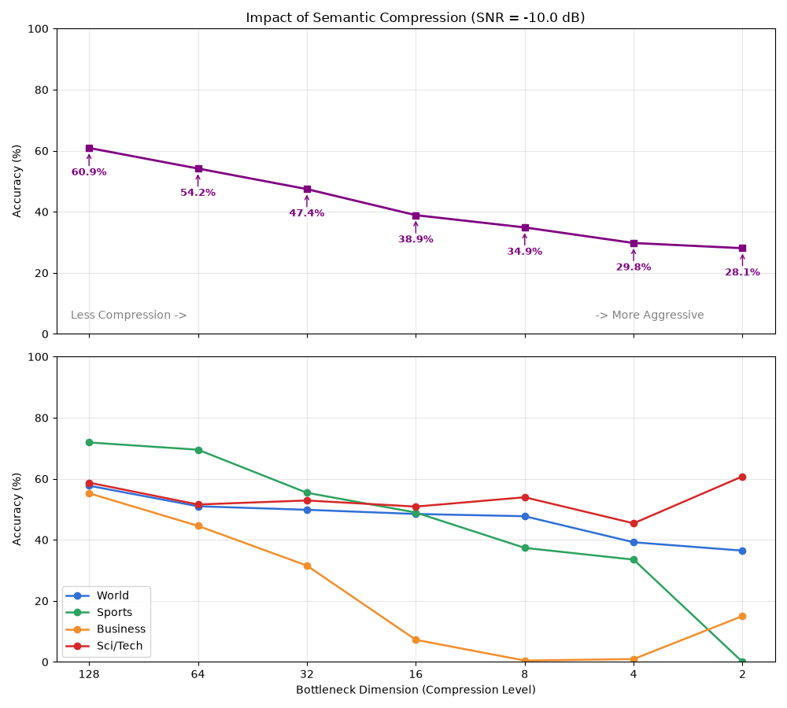
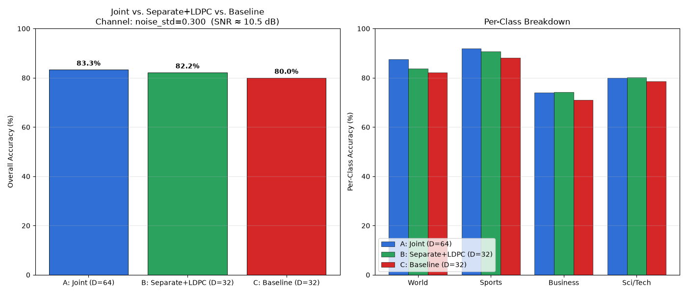

# Semantic Communication over Noisy Channels: Joint vs. Separate Source-Channel Coding

**Nadav Sharon and Ido Levinger**
Department of Electrical and Computer Engineering, Ben-Gurion University of the Negev
Supervisor: Prof. Assaf Cohen

---

## Abstract

In an era of exponentially growing data traffic, semantic communication offers an alternative to Shannon's classical bit-accurate paradigm: instead of guaranteeing the correct delivery of every transmitted bit, the goal is to deliver the *meaning* carried by a message. This paper presents a semantic communication system for text classification, built around a frozen BERT language model, a learned autoencoder bottleneck, a discrete QAM constellation quantizer, and a simulated AWGN channel. We study the trade-off between two design philosophies for protecting this pipeline against channel noise: **Joint Source-Channel Coding (JSCC)**, in which the autoencoder itself learns noise-robust representations, and the classical **separation approach**, in which a compressor is trained on a clean channel and protected at transmission time by a standard rate-1/2 Low-Density Parity-Check (LDPC) code. To keep the compression stage honest, the autoencoder is trained in a strictly **unsupervised** manner — it never observes the classification labels, only the original BERT embedding it must reconstruct. Our experiments show that (i) the semantic bottleneck dimension trades off compression fidelity against noise redundancy, (ii) a channel-aware joint encoder tolerates channel conditions as severe as $-10$ dB SNR far better than an equivalent low-dimensional bottleneck, and (iii) at a matched transmission bandwidth and a moderate noise level ($\approx 10.5$ dB), the jointly-trained encoder outperforms the classical compressor-plus-LDPC baseline (83.8% vs. 82.5% classification accuracy), while both clearly outperform an unprotected clean-trained baseline (80.7%). These results support the central claim of modern semantic communication research: under short block lengths and constrained bandwidth, a well-trained joint encoder can match or exceed classical separated designs.

**Keywords:** Semantic Communication, Joint Source-Channel Coding, BERT, Autoencoders, LDPC, AWGN Channel

---

## 1. Introduction

Shannon's separation theorem states that, given infinite block lengths, source coding (compression) and channel coding (error correction) can be designed independently without any loss of asymptotic performance [1]. Real systems, however, operate under finite block lengths, latency constraints, and limited bandwidth — conditions under which this theorem no longer strictly holds.

**Semantic communication** offers an alternative design target: rather than reconstructing the transmitted bits exactly, the system aims to preserve the *meaning* of the message well enough for a downstream task — in our case, classifying a news headline into one of four categories. Deep learning models, and in particular pretrained language models such as BERT, make it possible to map raw text into a continuous semantic space and to learn, end-to-end, how to compress, transmit, and recover the information that matters for the task.

This project investigates a central open question in this space: does a neural encoder trained *jointly* over a noisy channel outperform a neural encoder trained on a *clean* channel and protected at test time by a classical, mathematically-optimal error-correcting code (LDPC), when both are constrained to the same physical transmission bandwidth?

---

## 2. Related Work

Our baseline for the classical, separated approach rests on two foundational results in channel coding. Gallager introduced Low-Density Parity-Check (LDPC) codes and their iterative decoding procedure, showing that sparse parity-check structures can approach channel capacity with tractable decoding [2]. MacKay later demonstrated that LDPC codes decoded with belief propagation achieve performance extremely close to the Shannon limit in practice, cementing LDPC as a practical, near-capacity-achieving code family [3]. We use exactly this codec family — a rate-1/2 LDPC code with belief-propagation decoding — as the classical error-correction stage of our separation baseline.

On the source side, our semantic encoder is built on top of BERT, a pretrained bidirectional Transformer language model that produces contextual sentence embeddings widely used as a starting point for downstream NLP tasks [4]. The classification task and dataset (AG News, 4-class news categorization) follow the standard benchmark introduced for text classification with character/word-level neural models [5].

The broader research question — whether a jointly learned, noise-aware neural encoder can outperform a classically separated compression-plus-coding pipeline under finite block lengths — is the focus of the growing semantic- and joint source-channel-coding literature; our contribution is a controlled, bandwidth-matched empirical comparison of the two philosophies on a concrete text-classification task, rather than a new coding-theoretic result.

---

## 3. System Model

The system is a strict composition of five differentiable (or, at test time, partially non-differentiable) stages:

$$
t \;\xrightarrow{\ \text{BERT (frozen)}\ } e \in \mathbb{R}^{768}
  \;\xrightarrow{\ f_\theta\ } z \in \mathbb{R}^{D}
  \;\xrightarrow{\ Q\ } q
  \;\xrightarrow{\ \text{channel}\ } r
  \;\xrightarrow{\ g_\phi\ } \hat e \in \mathbb{R}^{768}
  \;\xrightarrow{\ h_\psi\ } \ell \in \mathbb{R}^{4}
  \;\longrightarrow\; \hat y .
$$

```
                         ┌────────────── learned end-to-end (two separate phases) ─────────────┐
                         │                                                                      │
Text ──► BERT ──► AE Encoder ──► Quantizer ──► AWGN Channel ──► AE Decoder ──► Classifier ──► Class
        (frozen)  768→512→256→D  soft/hard      y = x + n       D→256→512→768   residual MLP
        768-D CLS  + L2-norm     16-QAM grid    n ~ N(0,σ²I)                     768→4
                         │                                                                      │
                         └──────────────────────────────────────────────────────────────────────┘

Separation baseline (Option B / C) replaces the Quantizer + Channel stage with an explicit LDPC codec:

  AE Encoder ──► hard-quantize ──► symbols→bits (Gray) ──► LDPC encode (rate 1/2) ──► QAM map ──► AWGN
                                                                                                     │
  AE Decoder  ◄────── bits→symbols ◄────── LDPC decode (Belief Propagation) ◄────── soft-demap (LLRs) ◄┘
```

### 3.1 Semantic Source Encoder (frozen BERT)

Each input sentence $t$ is mapped to a fixed 768-dimensional embedding by a frozen `bert-base-uncased` model, pooling the `[CLS]` token from the last two hidden layers:

$$
e = \tfrac{1}{2} h^{(L)}_{[\text{CLS}]} + \tfrac{1}{2} h^{(L-1)}_{[\text{CLS}]} \in \mathbb{R}^{768}.
$$

BERT is never fine-tuned; embeddings are pre-computed once and cached, so every downstream experiment sees the identical semantic source vectors.

### 3.2 Learned Autoencoder and Power Normalization

A learned encoder $f_\theta : \mathbb{R}^{768} \to \mathbb{R}^{D}$ (768 → 512 → 256 → $D$, with batch normalization and ReLU activations) compresses the BERT embedding into a bottleneck of size $D$ (`BOTTLENECK_DIM`). The raw output is L2-normalized to a fixed energy so that the average power per transmitted symbol is a constant $P$, independent of the input:

$$
z = \sqrt{N P}\, \frac{f_\theta(e)}{\lVert f_\theta(e) \rVert_2} \in \mathbb{R}^{D}, \qquad N = D/2,
$$

where $N$ is the number of complex (I/Q) symbols obtained by pairing consecutive real dimensions of $z$. This fixed-power constraint is what makes the channel SNR (Section 3.4) a well-defined, input-independent quantity.

### 3.3 Constellation Quantization and the Straight-Through Estimator

The continuous vector $z$ is snapped onto a square $M$-QAM constellation ($M = 16$ throughout this work). Because the nearest-point assignment is a non-differentiable step function, training uses a **soft-to-hard** scheme: a temperature-weighted softmax over squared distances to the $M$ constellation points produces a smooth, differentiable "soft" assignment, while the actually-transmitted value is the hard nearest-neighbor assignment. The straight-through estimator (STE) lets the forward pass use the hard value while the backward pass uses the soft gradient:

$$
q_k = s_k^{\text{hard}} + \big(s_k^{\text{soft}} - \operatorname{sg}[s_k^{\text{soft}}]\big),
$$

where $\operatorname{sg}[\cdot]$ denotes the stop-gradient operator. The softmax temperature $\sigma_q$ is annealed upward during training (from 5 to a cap of 100) so that the soft and hard assignments converge by the end of training. A KL-divergence penalty additionally discourages the encoder from collapsing onto a small subset of constellation points, encouraging the full bit-budget of the constellation to be used.

### 3.4 AWGN Channel

The quantized signal $q$ passes through a channel that adds independent Gaussian noise to every real coordinate:

$$
r = q + n, \qquad n \sim \mathcal{N}(0, \sigma_n^2 I_D).
$$

Because $q$ has fixed average power $P$ per symbol, the channel SNR is a simple, well-defined function of $\sigma_n$:

$$
\mathrm{SNR}_{\mathrm{dB}} = 10 \log_{10}\frac{P}{\sigma_n^2}.
$$

With $P=1$: $\sigma_n=0.1 \Rightarrow 20$ dB, $\sigma_n=0.3 \Rightarrow{\approx}10.5$ dB, $\sigma_n=0.5\Rightarrow{\approx}6$ dB.

### 3.5 Learned Decoder and Task Classifier

An AE decoder $g_\phi : \mathbb{R}^{D} \to \mathbb{R}^{768}$ (D → 256 → 512 → 768) reconstructs the original BERT embedding from the received, noisy signal: $\hat e = g_\phi(r)$. A residual-MLP task classifier $h_\psi$ then reads this *reconstruction* (not the raw bottleneck) and outputs class logits $\ell = h_\psi(\hat e) \in \mathbb{R}^4$, with $\hat y = \arg\max_c \ell_c$.

### 3.6 Separation Baseline: LDPC Channel Coding

For the classical separation baseline, the differentiable quantizer/channel path is replaced at **inference time only** by an explicit channel-coding stage: hard constellation indices are Gray-coded into bits, encoded with a rate-1/2 LDPC generator matrix $G$ over $\mathrm{GF}(2)$, and mapped back onto the same QAM grid for transmission. At the receiver, the noisy symbols are soft-demapped into per-bit log-likelihood ratios (LLRs) and decoded via belief propagation over the parity-check matrix $H$. This stage is never active during training and carries no gradient — it is bolted onto an already-trained, clean-channel autoencoder, exactly matching the classical philosophy of independent source and channel code design.

---

## 4. Methodology

### 4.1 Unsupervised Semantic Compression

The central methodological choice in this project is to **decouple the classification task from the compression process**. The autoencoder (encoder + quantizer + channel + decoder) is trained purely to reconstruct the original BERT embedding, with no access to the classification labels:

$$
\mathcal{L}_1(\theta,\phi) = \mathbb{E}_e\Big[\lVert g_\phi(r) - e \rVert_2^2\Big] + \lambda_{\mathrm{KL}}\, D_{\mathrm{KL}}\big(\hat P \,\|\, U\big).
$$

Only after this autoencoder is trained and **frozen** is a classifier trained on top of its (frozen) reconstructions, minimizing a label-smoothed, class-weighted cross-entropy loss:

$$
\mathcal{L}_2(\psi) = \mathbb{E}_{(e,y)}\Big[-\sum_{c=1}^{4}\alpha_c\,\tilde y_c \log \operatorname{softmax}(h_\psi(\hat e))_c\Big].
$$

Because the autoencoder's forward pass runs under `torch.no_grad()` during Phase 2, no classification gradient ever reaches the encoder, decoder, or quantizer. This ensures the transmitted representation stays genuinely *semantic* — a general-purpose compressed meaning representation — rather than a task-specific shortcut that only happens to encode the four AG News labels. (An end-to-end variant, where the encoder is optimized directly by the classification loss, was also tested for comparison; it reaches comparable accuracy but by design loses the ability to reconstruct semantic content unrelated to the specific 4-class task, defeating the purpose of a general-purpose semantic channel.)

### 4.2 The Joint vs. Separate Experimental Design

The core experiment compares three configurations under a matched transmission bandwidth:

| | **A — Joint** | **B — Separate + LDPC** | **C — Baseline** |
|---|---|---|---|
| Bottleneck dimension | 64 | 32 | 32 (same checkpoint as B) |
| Training channel | AWGN (noise-aware) | Clean (no noise) | Clean (no noise) |
| Channel coding at test time | None | Rate-1/2 LDPC | None |
| Transmitted real dimensions | 64 | 64 (32 info → 64 coded symbols) | 32 (uncoded) |

Option A's encoder learns noise-robust representations directly; no external error correction is used. Option B's encoder is trained on a clean channel and focuses purely on compression fidelity, with all channel protection supplied by the rate-1/2 LDPC code at test time — the classical *separation* design, where the encoder and the channel code are designed independently. Option C reuses Option B's checkpoint but removes the LDPC protection at test time, isolating exactly how much of B's performance is attributable to the LDPC stage rather than the compressor itself.

---

## 5. Experimental Setup

**Dataset.** AG News (4-class topic classification: World, Sports, Business, Sci/Tech), 50,000 training sentences and 7,600 test sentences, with a further 20% of the training split held out for validation.

**Training.** AdamW optimizer, learning rate $3\times10^{-4}$, batch size 128, up to 50 epochs per phase with early stopping (patience 8 epochs: validation MSE for Phase 1, validation accuracy for Phase 2). Cross-entropy uses label smoothing $\varepsilon=0.05$ and class weights $[1.0, 1.0, 1.15, 1.15]$ (up-weighting the harder Business/Sci-Tech classes).

**Quantizer.** 16-QAM ($M=16$, 4 bits/symbol), unit average symbol power, softmax hardness annealed from $\sigma_q=5$ to a cap of 100, KL-uniformity weight $\lambda_{\mathrm{KL}}=0.05$.

**Channel.** AWGN with standard deviation $\sigma_n$ swept from 0.1 ($\approx$20 dB) to 0.5 ($\approx-10$dB, with $\sigma_n>1$ giving negative dB); each channel-aware experiment trains and evaluates a dedicated model per noise level (never testing a model on an SNR it was not trained for, except where mismatch is explicitly the variable under study).

---

## 6. Experimental Results

### 6.1 Compression in a Clean Channel and the "Baseline Illusion"

In a clean channel (SNR = 20 dB), classification accuracy degrades gracefully as the bottleneck dimension shrinks from 128 to 16, then drops sharply below that:


| Bottleneck dim | 128 | 64 | 32 | 16 | 8 | 4 | 2 |
|---|---|---|---|---|---|---|---|
| Accuracy | 87.1% | 86.0% | 83.3% | 80.9% | 75.7% | 70.6% | 64.9% |

Measuring the autoencoder's reconstruction fidelity in isolation (cosine similarity between the reconstructed and original 768-D BERT embedding, with no classifier involved) shows a much smoother decline, from 96.3% at $D=128$ to 88.3% at $D=2$:


At first glance, 88.3% cosine similarity at a 2-dimensional bottleneck (a single 16-QAM symbol) looks like a strong result. It is not: the average cosine similarity between *any* AG News sentence embedding and the dataset's global mean embedding is already $\approx 85.98\%$, because BERT sentence embeddings occupy a narrow cone in the 768-dimensional embedding space rather than being uniformly spread out. A 2-dimensional bottleneck has only 16 possible reconstructions to offer, and it uses them to nudge the "similarity floor" from 86.0% up to 88.3% — enough to beat random guessing (25%) by a wide margin, but nowhere near enough to preserve the fine-grained semantic distinctions the classifier needs, which is exactly why classification accuracy collapses to 64.9% at this bottleneck size. Only at higher dimensions does reconstruction fidelity climb into the 92–96% range where the nuances that separate the four categories actually survive.

### 6.2 Compression Under Light Channel Noise (SNR = 10 dB)

Adding a realistic amount of channel noise (SNR = 10 dB) leaves the high-dimensional regime largely intact but steepens the drop at small bottlenecks, since the compressed representation must now survive both aggressive compression and channel noise simultaneously:



| Bottleneck dim | 128 | 64 | 32 | 16 | 8 | 4 | 2 |
|---|---|---|---|---|---|---|---|
| Accuracy | 85.5% | 83.6% | 79.9% | 76.8% | 70.6% | 64.7% | 54.1% |

### 6.3 Compression Under Severe Channel Noise (SNR = −10 dB)

At $-10$ dB, noise energy is ten times larger than signal energy. High-dimensional bottlenecks still extract partial semantic content, but the smallest bottleneck (2 dimensions) collapses almost to the 25% random-guess floor:



| Bottleneck dim | 128 | 64 | 32 | 16 | 8 | 4 | 2 |
|---|---|---|---|---|---|---|---|
| Accuracy | 60.9% | 54.2% | 47.4% | 38.9% | 34.9% | 29.8% | 28.1% |

### 6.4 Noise Robustness Through Redundancy (SNR Sweep at a Fixed 64-D Bottleneck)

Fixing the bottleneck at 64 dimensions (wide enough for high-fidelity semantic transfer) and sweeping the channel from 20 dB down to $-10$ dB — with a *dedicated, channel-matched model trained separately for every noise level* — shows how much noise redundancy in the bottleneck alone can absorb:


| SNR (dB) | 20 | 10 | 0 | −10 |
|---|---|---|---|---|
| Accuracy | 85.5% | 83.2% | 74.0% | 50.7% |

Even at $-10$ dB, where the noise power is an order of magnitude larger than the signal power, the 64-dimensional channel-aware model retains 50.7% accuracy — more than double the accuracy of the 2-dimensional model at the same noise level (28.1%, Section 6.3). Extra bottleneck dimensions therefore serve a dual role: they carry additional semantic detail, and — because the encoder is free to spread information redundantly across them — they act as a naturally learned channel code.

### 6.5 The Cost of SNR Mismatch

The experiments above always evaluate a model at the same SNR it was trained for (channel-aware / matched-SNR operation). To quantify the cost of *not* re-tuning to the channel, a single model was trained once at 10 dB (D = 64) and then evaluated, without retraining, across the full SNR range:


| Evaluation SNR (dB) | 20 | 10 (training point) | 0 | −10 |
|---|---|---|---|---|
| Mismatched-model accuracy | 85.8% | 83.3% | 63.3% | 37.6% |
| Matched, channel-aware model (Section 6.4) | 85.5% | 83.2% | 74.0% | 50.7% |

The mismatched model performs essentially identically to a dedicated model when the channel is cleaner than or equal to its training condition, but collapses sharply once the true channel is noisier than what it was trained for — 37.6% at $-10$ dB, versus 50.7% for a model trained specifically for that noise level. This demonstrates that a fixed, "one-size-fits-all" constellation is not sufficient in a hostile or time-varying channel; some form of channel estimation and model or constellation adaptation is necessary in practice.

### 6.6 Joint vs. Separate Source-Channel Coding

The final experiment directly compares the three configurations of Section 4.2 at a single, matched channel condition ($\sigma_n = 0.300$, SNR $\approx 10.5$ dB) and a matched transmission budget of 64 real dimensions:



| Configuration | Bottleneck | Channel coding | Overall accuracy | Avg. reconstruction MSE |
|---|---|---|---|---|
| A — Joint (noise-aware) | 64 | none | **83.8%** | **0.0245** |
| B — Separate + LDPC | 32 | rate-1/2 LDPC | 82.5% | 0.0270 |
| C — Baseline (Separate, no LDPC) | 32 | none | 80.7% | 0.0304 |

Two results stand out. First, comparing B against C isolates the pure contribution of the LDPC stage: adding rate-1/2 LDPC protection to the same clean-trained compressor recovers 1.8 accuracy points and reduces semantic reconstruction MSE from 0.0304 to 0.0270 — LDPC is doing real, measurable error-correction work. Second, comparing A against B shows that, at this matched bandwidth and this channel condition, the jointly-trained encoder outperforms the classically-protected compressor by 1.3 points, despite using no explicit error-correcting code at all — its noise robustness is instead baked into the learned representation itself. The same ordering holds in the per-class breakdown (Sports, the easiest class, and Business/Sci-Tech, the hardest pair, are consistently ranked A > B > C) and in reconstruction MSE, confirming the effect is not an artifact of the classifier alone but reflects a genuinely better-preserved semantic signal at the AE-decoder output.

We note that this three-way comparison was evaluated at a single fixed channel condition ($\approx$10.5 dB); the noise-robustness results of Section 6.4 (a channel-aware joint model surviving down to $-10$ dB) were obtained without an LDPC-protected point of comparison at those extreme conditions. Extending the joint-vs-separate comparison across a full SNR sweep — to locate the "crossover" SNR at which classical error correction becomes strictly necessary — is identified as future work (Section 8).

---

## 7. Discussion

Two forces trade off against each other in this system, and the experiments in Section 6 pull them apart cleanly. Compressing more aggressively (smaller $D$) discards semantic detail, as the smooth degradation of reconstruction cosine similarity in Section 6.1 shows directly. But wider bottlenecks are also more forgiving of channel noise: an encoder with more room can spread the same information redundantly across additional dimensions, and this redundancy is exactly what the channel-aware model exploits in Section 6.4 to survive down to $-10$ dB SNR. The bottleneck dimension is therefore not simply a "compression knob" — it simultaneously plays the role of a rate parameter for a channel code the network invents for itself, without ever being told what a channel code is.

The "baseline illusion" of Section 6.1 is a methodological warning worth stating explicitly: because pretrained sentence embeddings are not uniformly distributed but occupy a narrow region of their ambient space, naive fidelity metrics like cosine similarity can look deceptively good even when almost no task-relevant information has survived. Any evaluation of semantic compression should be anchored against this kind of "do-nothing" baseline (the similarity of the dataset's mean vector to a random sample) rather than judged against 100% in isolation.

Finally, the SNR-mismatch results (Section 6.5) and the joint-vs-LDPC comparison (Section 6.6) together sketch a coherent design picture. A jointly-trained encoder is a strong choice when the channel condition is known and stable, requiring no side channel-coding machinery. A classically separated design is more modular — the same compressor can be paired with different, off-the-shelf channel codes for different channel conditions — but it depends entirely on accurate channel knowledge (Section 6.5) and, absent that channel code, degrades faster than an equivalently-sized joint encoder (Section 6.6, comparing B against C). In our matched-bandwidth, matched-condition test, the joint approach edged out the classical separation approach, but by a modest margin (1.3 points) that likely narrows or reverses at some SNR still to be located.

---

## 8. Conclusion and Future Work

This work built and evaluated an end-to-end semantic communication pipeline for text classification: a frozen BERT encoder feeding a learned, unsupervised autoencoder bottleneck, a differentiable 16-QAM constellation quantizer trained with a straight-through estimator, an AWGN channel, and a residual-MLP classifier. Keeping the autoencoder's training strictly label-free ensured that the measured compression and noise-robustness results reflect genuine semantic preservation rather than task-specific shortcuts.

The results show that (1) the bottleneck dimension of a semantic communication system serves a dual purpose — carrying fine-grained meaning and absorbing channel noise as a form of implicit, learned redundancy; (2) apparent reconstruction fidelity must always be read against the true "baseline illusion" of the embedding space, not against a naive 100% ceiling; (3) channel-aware training is essential — a single fixed model trained for one SNR degrades sharply once the true channel becomes noisier than expected; and (4) in a bandwidth-matched, single-condition comparison, a jointly-trained noise-aware encoder outperformed a classically separated compressor-plus-LDPC design, while the LDPC stage itself was independently shown to provide a clear, measurable benefit over an unprotected baseline.

Future work includes: (i) sweeping the joint-vs-separate comparison of Section 6.6 across the full SNR range to locate the crossover point at which classical coding overtakes the learned approach; (ii) replacing the fixed/soft-to-hard QAM quantizer with a learned vector-quantization scheme (e.g., VQ-VAE-style codebooks); (iii) scaling the semantic encoder to larger generative language models; and (iv) extending the single-link AWGN model to multi-user and MIMO channel settings.

---

## References

[1] C. E. Shannon, "A Mathematical Theory of Communication," *Bell System Technical Journal*, vol. 27, pp. 379–423, 623–656, 1948.

[2] R. G. Gallager, "Low-Density Parity-Check Codes," *IRE Transactions on Information Theory*, vol. IT-8, no. 1, pp. 21–28, Jan. 1962.

[3] D. J. C. MacKay, "Good Error-Correcting Codes Based on Very Sparse Matrices," *IEEE Transactions on Information Theory*, vol. 45, no. 2, pp. 399–431, Mar. 1999.

[4] J. Devlin, M.-W. Chang, K. Lee, and K. Toutanova, "BERT: Pre-training of Deep Bidirectional Transformers for Language Understanding," in *Proc. NAACL-HLT*, 2019.

[5] X. Zhang, J. Zhao, and Y. LeCun, "Character-level Convolutional Networks for Text Classification," in *Advances in Neural Information Processing Systems (NeurIPS)*, 2015.
